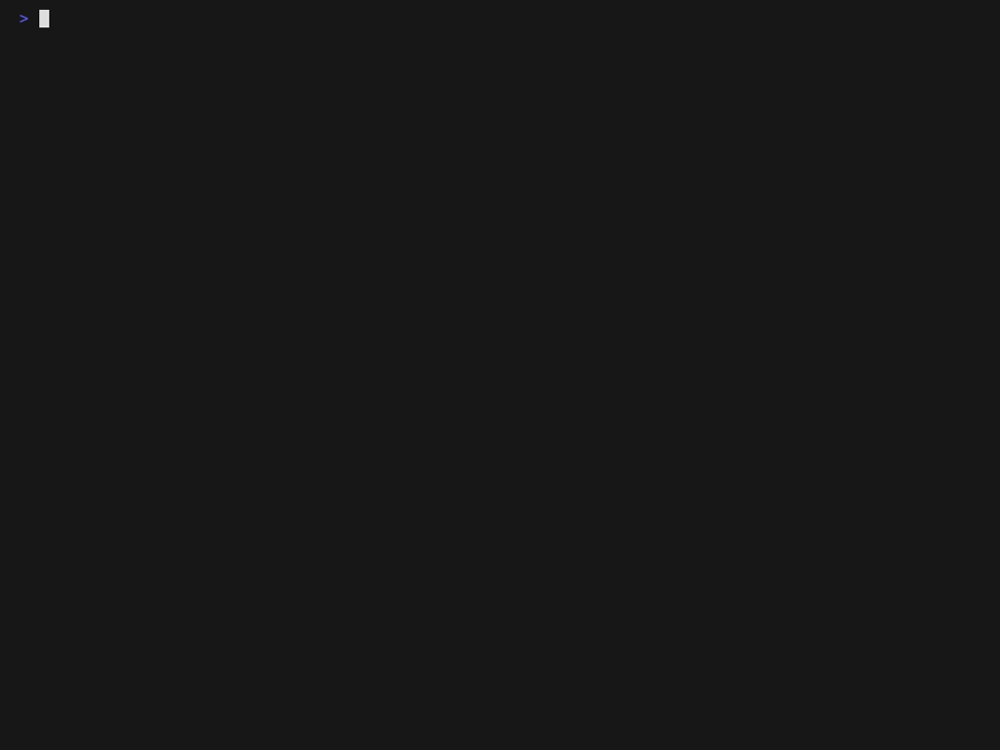

<!--

This work is marked CC0 1.0 Universal.  To view a copy of this mark,
visit https://creativecommons.org/publicdomain/zero/1.0/.

-->

# RDCT Templates Library

Bootstrap new work using the provided source code templates with
[cookiecutter](https://cookiecutter.readthedocs.io/).
[_Good DevOps Practice_](https://github.com/ResearchDataCom/good-devops-practice)
describes the underlying methodology and recommended tooling in
greater detail.  For example:

```sh
cookiecutter gh:ResearchDataCom/templates
```

> [!IMPORTANT]
>
> The project slug **MUST** be in
> [snake_case](https://en.wikipedia.org/wiki/Snake_case), and the
> project description **MUST** be one complete sentence.  The project
> slug seeds the default values of the other settings, which
> developers **MAY** tailor as needed.  Cookiecutter creates a
> directory named after the package slug, which **SHOULD** default to
> the project slug converted to
> [kebab-case](https://en.wikipedia.org/wiki/Kebab_case) depending on
> the template.

[](demo.tape)
